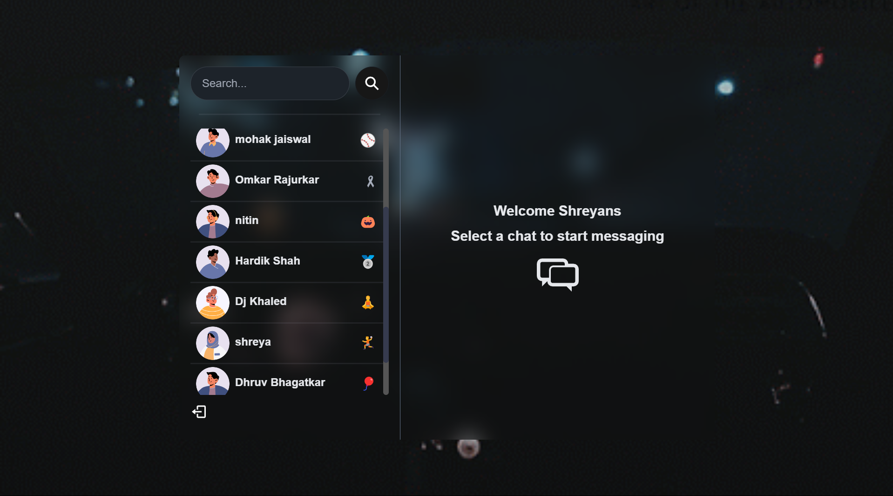

# MERN Stack Project: Build and Deploy a Real Time Chat App | JWT, Socket.io



[Live Now!!](https://www.twizzychat.xyz/)

Some Features:

-    Tech stack: MERN + Socket.io + TailwindCSS + Daisy UI
-    Authentication && Authorization with JWT
-    Real-time messaging with Socket.io
-    Online user status (Socket.io and React Context)
-    Global state management with Zustand

### Setup .env file

```js
PORT=...
MONGO_DB_URI=...
JWT_SECRET=...
NODE_ENV=...
```

### Build the app

```shell
npm run build
```

### Start the app

```shell
npm start
```